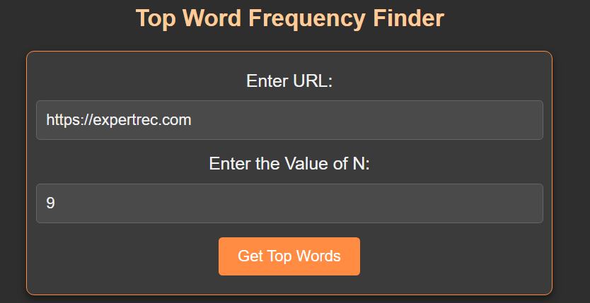
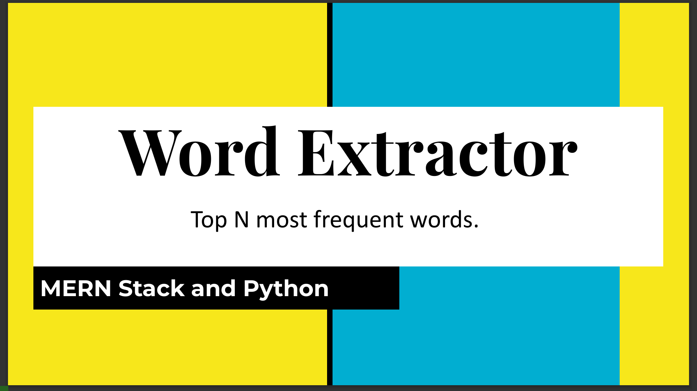

# Word-Extractor-Project

## Overview

The **Cloud-Bash-Project** is a web application designed to analyze the content of any web page provided via a URL input. The frontend interacts with a backend REST API, which fetches the page content, processes it, and returns the top N most frequent words. The frontend then displays these words and their frequencies in a neat table. This project combines HTML/CSS frontend with backend processing in a powerful tech stack, making it a compact, efficient word frequency analyzer.

## Features

- **URL Input**: Users can input any webpage link they want to analyze.
- **Backend Processing**: The backend fetches the page content and computes the most frequent words.
- **Word Frequency Table**: A visually structured table displays each word alongside its frequency count.
  
## Screenshots

1. **Input Page**: The initial page where users can input the URL (shown below).
   

2. **Output Page**: The result page displaying the word frequency table.
   

## Project Structure

### 1. Title
   

### 2. Tech Stack
   

### 3. Project Overview
   

### 4. Workflow
   

### 5. Data Structures Used
   

### 6. Python Script Work
   

### 7. Future Enhancements
   

## Tech Stack

- **Frontend**: HTML, CSS, JavaScript
- **Backend**: Node.js, Express
- **Web Scraping & Analysis**: Python (BeautifulSoup, collections for word frequency)
- **REST API**: Facilitates communication between frontend and backend

## Installation & Setup

1. Clone the repository:
   ```bash
   git clone https://github.com/yourusername/Cloud-Bash-Project.git
   cd Cloud-Bash-Project
   
2. Install dependencies:
  ```bash
   npm install
